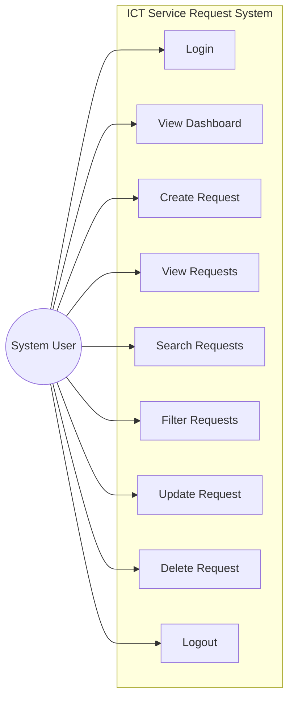
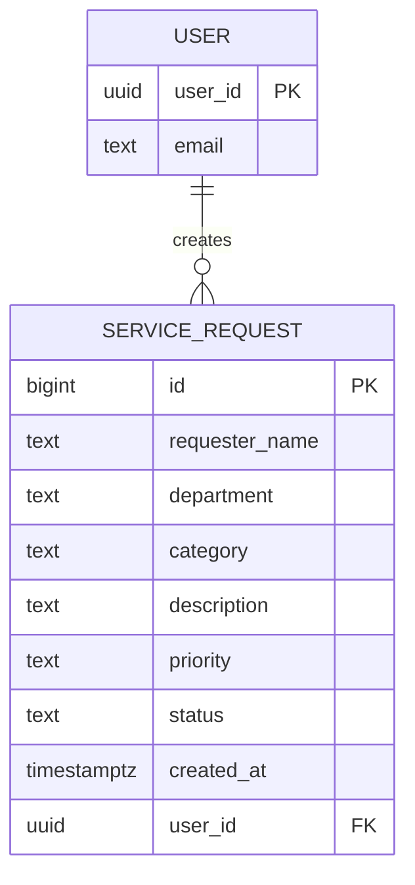

# Systems Analysis Documentation

## 1. Problem Statement

The university ICT office receives technical support requests through verbal requests, text messages, and social media. This fragmented approach causes requests to be forgotten, duplicated, or left unmonitored. There is no centralized system for recording, tracking, or managing ICT service requests, making it difficult to ensure timely resolution and accountability.

---

## 2. Actors

| Actor | Description |
|-------|-------------|
| **System User / ICT Personnel** | Primary actor. Logs in, submits service requests, views all requests, updates request status, searches and filters records, and deletes requests they created. |

---

## 3. Use Case Diagram



---

## 4. Entity-Relationship Diagram



**Relationship:** One USER can create many SERVICE_REQUESTs. Each SERVICE_REQUEST belongs to one USER.

---

## 5. Requirements Traceability Matrix

| Req. ID | Requirement | System Feature | Test Case |
|---------|-------------|---------------|-----------|
| FR-01 | User can log in | Login Page (`login.html`) | TC-01 |
| FR-02 | User can create a service request | New Request Form (modal) | TC-02 |
| FR-03 | User can view all service requests | Request Table (`index.html`) | TC-03 |
| FR-04 | User can update a service request | Edit Function (modal) | TC-04 |
| FR-05 | User can delete a service request | Delete with confirmation dialog | TC-05 |
| FR-06 | User can search requests | Search input (name/description) | TC-06 |
| FR-07 | User can filter requests | Status & Priority dropdowns | TC-07 |
| FR-08 | System displays request summaries | Dashboard cards (Total, Pending, In Progress, Completed) | TC-08 |

---

## 6. Business Rules Implementation

| Rule | Requirement | Implementation |
|------|-------------|----------------|
| BR-01 | Requester name cannot be empty | Form validation — required field check |
| BR-02 | Department must be provided | Form validation — required field check |
| BR-03 | Category must be selected | Form validation — dropdown must have selection |
| BR-04 | Description must contain sufficient information | Form validation — minimum 10 characters |
| BR-05 | Priority must be Low, Medium, or High | Form validation — dropdown restricted values |
| BR-06 | New requests automatically receive Pending status | `status` auto-set to "Pending" on create |
| BR-07 | Users must log in before managing requests | Session guard — redirect to login if unauthenticated |
| BR-08 | Confirmation must appear before deleting | Delete confirmation dialog |
| BR-09 | Date requested must automatically be recorded | `created_at` column with DEFAULT NOW() |
| BR-10 | Unauthorized database modification prevented | Supabase RLS — users can only modify own records |

---

## 7. Functional Test Cases

| Test ID | Test Scenario | Steps | Expected Result | Status |
|---------|--------------|-------|----------------|--------|
| TC-01 | Login using valid account | Enter valid email and password, click Sign In | Dashboard appears with user email shown | ☐ PASS / ☐ FAIL |
| TC-02 | Submit a valid service request | Click New Request, fill all fields, click Submit | Request saved and appears in table with Pending status | ☐ PASS / ☐ FAIL |
| TC-03 | Display all requests | Log in and view request table | All existing records appear in table | ☐ PASS / ☐ FAIL |
| TC-04 | Modify a request | Click Edit on own request, change fields, click Save | Changes saved and reflected in table | ☐ PASS / ☐ FAIL |
| TC-05 | Delete a request | Click Delete on own request | Confirmation dialog appears; after confirming, record is removed | ☐ PASS / ☐ FAIL |
| TC-06 | Search by requester name | Type a name in the search box | Only matching records are displayed | ☐ PASS / ☐ FAIL |
| TC-07 | Filter by Pending status | Select "Pending" from Status dropdown | Only Pending records are displayed | ☐ PASS / ☐ FAIL |
| TC-08 | Open deployed URL | Navigate to GitHub Pages URL | Application loads, login page appears | ☐ PASS / ☐ FAIL |

---

## 8. Supabase SQL Setup

Run these commands in the **Supabase SQL Editor** to set up the database:

### Create Table

```sql
CREATE TABLE service_requests (
    id BIGINT GENERATED BY DEFAULT AS IDENTITY PRIMARY KEY,
    requester_name TEXT NOT NULL,
    department TEXT NOT NULL,
    category TEXT NOT NULL,
    description TEXT NOT NULL,
    priority TEXT NOT NULL,
    status TEXT DEFAULT 'Pending',
    created_at TIMESTAMPTZ DEFAULT NOW(),
    user_id UUID REFERENCES auth.users(id)
);
```

### Enable Row Level Security

```sql
ALTER TABLE service_requests ENABLE ROW LEVEL SECURITY;
```

### Create RLS Policies

```sql
-- All authenticated users can view all requests
CREATE POLICY "Authenticated users can view requests"
ON service_requests FOR SELECT
TO authenticated
USING (true);

-- Users can only insert requests with their own user_id
CREATE POLICY "Authenticated users can insert requests"
ON service_requests FOR INSERT
TO authenticated
WITH CHECK (auth.uid() = user_id);

-- Users can only update their own requests
CREATE POLICY "Authenticated users can update requests"
ON service_requests FOR UPDATE
TO authenticated
USING (auth.uid() = user_id);

-- Users can only delete their own requests
CREATE POLICY "Authenticated users can delete requests"
ON service_requests FOR DELETE
TO authenticated
USING (auth.uid() = user_id);
```
